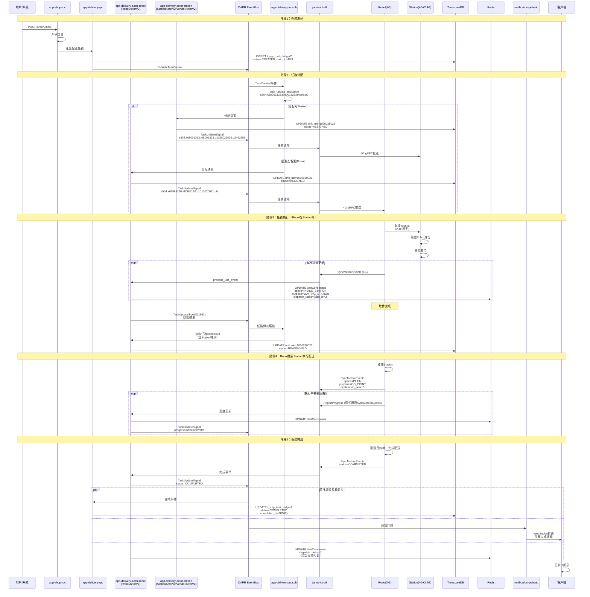

# 任務閉環流程技術文檔

**文檔版本**: v1.0
**最後更新**: 2025-12-10
**作者**: 基於實際log驗證的系統探索成果
**狀態**: ✅ 已完成

---

## 目錄

1. [任務生命週期總覽](#任務生命週期總覽)
2. [階段1：任務創建](#階段1任務創建)
3. [階段2：任務分配](#階段2任務分配)
4. [階段3：任務執行](#階段3任務執行)
5. [階段4：任務回報](#階段4任務回報)
6. [階段5：任務完成](#階段5任務完成)
7. [異常處理流程](#異常處理流程)
8. [實際案例分析](#實際案例分析)

---

## 任務生命週期總覽

### 狀態機定義

```
┌─────────────┐
│   CREATED   │  任務已創建，待分配
│  (uNone)    │
└──────┬──────┘
       │ AssignTask
       ▼
┌─────────────┐
│  ASSIGNED   │  已分配給Station或Robot
│ (unit_uid)  │
└──────┬──────┘
       │ 可選：任務轉派
       ▼
┌─────────────┐
│ REASSIGNED  │  從Station轉給Robot
│ (new_unit)  │  (TaskUpdateSignal觸發)
└──────┬──────┘
       │ Robot開始執行
       ▼
┌─────────────┐
│ EXECUTING   │  執行中
│ IN_PROGRESS │  (Robot持續回報進度)
└──────┬──────┘
       │ 執行結果
       ▼
┌─────────────┐     ┌─────────────┐
│  COMPLETED  │     │   FAILED    │
│   (成功)     │     │   (失敗)     │
└─────────────┘     └─────────────┘
```

### 完整流程時序圖



---

## 階段1：任務創建

### 1.1 觸發方式

**方式1：用戶下單**
```http
POST https://robot-api.aurotek.com/app-shop/customer/order2/new
Authorization: Bearer {JWT_TOKEN}
Content-Type: application/json

{
  "product_id": 12345,
  "quantity": 1,
  "delivery_location": {
    "building": "A棟",
    "floor": 5,
    "room": "501"
  },
  "customer_phone": "0912345678"
}
```

**方式2：系統觸發**
- 定時任務（如定期巡檢）
- 告警觸發（如設備異常需維修）
- 第三方系統調用

### 1.2 訂單處理流程

**app-shop-rpc處理**：
```python
# 簡化的訂單處理邏輯
async def create_order(order_request):
    # 1. 驗證訂單資訊
    validate_order(order_request)

    # 2. 創建訂單記錄
    order = await db.insert_order({
        "customer_id": order_request.customer_id,
        "product_id": order_request.product_id,
        "status": "PENDING",
        "created_at": datetime.now()
    })

    # 3. 產生配送任務
    task = await create_delivery_task(order)

    # 4. 調用app-delivery-rpc
    await app_delivery_rpc.create_task(task)

    return {"order_id": order.id, "task_id": task.id}
```

### 1.3 任務記錄創建

**app-delivery-rpc創建任務**：
```sql
-- TimescaleDB插入
INSERT INTO t_app_task_ledger2 (
    task_id,
    task_uuid,
    site_uid,
    unit_uid,
    task_type,
    status,
    pickup_location,
    delivery_location,
    metadata,
    created_at
) VALUES (
    67985120,                                  -- 自增ID
    'd25d1020-d158-431c-bfd3-106b4ce7618e',   -- UUID
    504,                                       -- 站點ID
    NULL,                                      -- 待分配，初始為NULL
    'DELIVERY',                                -- 任務類型
    'CREATED',                                 -- 初始狀態
    jsonb '{"poi_id": 5, "station_id": 1020025026}',
    jsonb '{"building": "A棟", "floor": 5, "room": "501"}',
    jsonb '{"order_id": 12345, "priority": "NORMAL"}',
    NOW()
);
```

**數據結構**：
```json
{
  "task_id": 67985120,
  "task_uuid": "d25d1020-d158-431c-bfd3-106b4ce7618e",
  "site_uid": 504,
  "unit_uid": null,
  "status": "CREATED",
  "task_type": "DELIVERY",
  "pickup_location": {
    "poi_id": 5,
    "station_id": 1020025026
  },
  "delivery_location": {
    "building": "A棟",
    "floor": 5,
    "room": "501"
  },
  "metadata": {
    "order_id": 12345,
    "priority": "NORMAL",
    "estimated_duration": 600
  },
  "created_at": "2025-10-28T15:41:35+08:00"
}
```

### 1.4 任務創建事件發布

**DAPR Publish**：
```python
# app-delivery-rpc發布任務創建事件
await dapr_client.publish_event(
    pubsub_name="pubsub",
    topic_name="task_update",
    data={
        "event_type": "TASK_CREATED",
        "task_id": 67985120,
        "task_uuid": "d25d1020-...",
        "site_uid": 504,
        "status": "CREATED",
        "timestamp": "2025-10-28T15:41:35+08:00"
    },
    data_content_type="application/json"
)
```

**Pubsub訂閱格式**：
```
s504.k67985120.t67985120.uNone.p0
 │    │          │          │    └─ pickup_id (初始為0)
 │    │          │          └────── unit_uid (None表示未分配)
 │    │          └─────────────────  task_id
 │    └────────────────────────────  key_id (通常等於task_id)
 └─────────────────────────────────  site_uid
```

---

## 階段2：任務分配

### 2.1 分配策略

**app-delivery-pubsub接收並處理**：
```python
class DeliveryPubsub:
    async def task_update_subscribe(self, event_data):
        """訂閱任務更新事件"""
        task_id = event_data["task_id"]
        site_uid = event_data["site_uid"]
        unit_uid = event_data.get("unit_uid")  # 可能為None

        if unit_uid is None:
            # 待分配任務，執行分配邏輯
            await self.assign_task(task_id, site_uid)

    async def assign_task(self, task_id, site_uid):
        """任務分配邏輯"""
        # 1. 查詢任務詳情
        task = await self.get_task_info(task_id)

        # 2. 分配決策
        assignment = await self.make_assignment_decision(task, site_uid)

        # 3. 更新任務分配
        if assignment["target_type"] == "ROBOT":
            await self.assign_to_robot(task_id, assignment["unit_uid"])
        elif assignment["target_type"] == "STATION":
            await self.assign_to_station(task_id, assignment["unit_uid"])
```

**分配算法（推測）**：
```python
async def make_assignment_decision(self, task, site_uid):
    """分配決策算法"""

    # 1. 獲取可用設備列表
    available_robots = await self.get_available_robots(site_uid)
    available_stations = await self.get_available_stations(site_uid)

    # 2. 根據任務類型決定
    if task["task_type"] == "DELIVERY":
        # 配送任務優先考慮Station模式
        if task["pickup_location"]["station_id"]:
            # 需要從Station取件，先分配給Station
            return {
                "target_type": "STATION",
                "unit_uid": task["pickup_location"]["station_id"]
            }

    # 3. 根據距離和負載選擇Robot
    best_robot = await self.select_best_robot(
        available_robots,
        task["pickup_location"],
        criteria=["distance", "battery", "current_load"]
    )

    return {
        "target_type": "ROBOT",
        "unit_uid": best_robot["unit_uid"]
    }
```

### 2.2 分配到Station

> **備註**：`app-delivery-actor-station` 服務同時處理 `StationActorV2`（配送站點）和 `VendorActorV2`（取貨點/供應商）。本文檔聚焦 Station-Robot 任務閉環流程，Vendor 流程類似但用於不同業務場景。

**ActorStation處理**：
```python
# app-delivery-actor-station
class StationActorV2:
    actor_id: str = "s504.u1020025026"  # station5-067

    async def assign_task(self, task_id, task_info):
        """Station接收任務分配"""
        # 1. 更新數據庫
        await db.update_task(
            task_id=task_id,
            unit_uid=self.station_uid,
            status="ASSIGNED",
            assigned_at=datetime.now()
        )

        # 2. 發布TaskUpdateSignal
        await dapr.publish_event(
            topic="task_update_signal",
            data={
                "event_id": generate_event_id(),
                "task_id": task_id,
                "unit_uid": self.station_uid,
                "status": "ASSIGNED",
                "timestamp": datetime.now()
            }
        )

        # 3. 通知IoT層
        await iot_client.notify_station_task(
            station_uid=self.station_uid,
            task_id=task_id
        )
```

**Pubsub更新**：
```
# 從待分配
s504.k68001323.t68001323.uNone.p0

# 到分配給Station
s504.k68001323.t68001323.u1020025026.p2492959
```

### 2.3 分配到Robot（直接模式）

**ActorRobot處理**：
```python
# app-delivery-actor-robot
class RobotActorV2:
    actor_id: str = "s504.u1010020021"

    async def assign_task(self, task_id, task_info):
        """Robot接收任務分配"""
        # 1. 檢查Robot狀態
        if not await self.check_robot_ready():
            raise RobotNotReadyException()

        # 2. 更新數據庫
        await db.update_task(
            task_id=task_id,
            unit_uid=self.robot_uid,
            status="ASSIGNED",
            assigned_at=datetime.now()
        )

        # 3. 更新Redis狀態
        await redis.hset(
            f"UnitConsensus@s{self.site_uid}.u{self.robot_uid}",
            mapping={
                "dispatch_tasks": json.dumps([task_id]),
                "updated_at": datetime.now().isoformat()
            }
        )

        # 4. 發布事件
        await dapr.publish_event(
            topic="task_update_signal",
            data={
                "task_id": task_id,
                "unit_uid": self.robot_uid,
                "status": "ASSIGNED"
            }
        )
```

**Pubsub更新**：
```
# 直接分配給Robot
s504.k67985120.t67985120.u1010020021.p0
```

### 2.4 IoT層通知

**jarvis-iot-v6處理**：
```python
# jarvis-iot-v6
class IoTService:
    async def on_task_assigned(self, task_event):
        """接收任務分配事件"""
        unit_uid = task_event["unit_uid"]
        task_id = task_event["task_id"]

        # 查詢設備連接狀態
        unit_connection = await self.get_unit_connection(unit_uid)

        if unit_connection and unit_connection["is_online"]:
            # 設備在線，通過gRPC推送任務
            await self.push_task_to_unit(unit_uid, task_id)
        else:
            # 設備離線，等待下次QueryLinkOrders時拉取
            await redis.sadd(f"pending_tasks:{unit_uid}", task_id)
```

---

## 階段3：任務執行

### 3.1 Robot到達Station

**2.4G本地通信握手**（重要！）：
```
1. Robot靠近Station艙門
   ↓
2. Station透過2.4G廣播信號
   ↓
3. Robot接收信號，發送身份認證請求 (2.4G)
   ↓
4. Station驗證Robot ID
   ↓
5. Station控制艙門開啟
   ↓
6. Robot進入Station
```

**物理實驗證據**（2025-10-28）：
- 拔除2.4G電源後，Robot無法進入Station
- process_unit_event出現錯誤
- 證明2.4G對本地協作至關重要

### 3.2 Robot狀態同步

**每秒狀態更新**：
```python
# RobotActorV2.ping() 每秒執行
async def ping(self):
    """Robot Actor心跳"""
    # 1. 獲取最新Robot狀態（通過SyncMeteorEvents）
    robot_state = await self.get_latest_robot_state()

    # 2. 更新Redis
    await redis.hset(
        f"UnitConsensus@s{self.site_uid}.u{self.robot_uid}",
        mapping={
            "space": robot_state["space"],          # INSIDE_STATION
            "purpose": robot_state["purpose"],      # WAITING_STATION
            "mission_type": robot_state["mission"], # STANDBY
            "work_status": robot_state["status"],   # BUSYNESS
            "dispatch_tasks": json.dumps([2]),      # 當前任務ID
            "task_uuid": robot_state["task_uuid"],  # 3a39b3bb-...
            "battery_level": robot_state["battery"],
            "updated_at": datetime.now().isoformat()
        }
    )

    # 3. 檢查狀態變化
    if await self.detect_state_change(robot_state):
        # 狀態變化，發布事件
        await self.publish_state_change_event(robot_state)
```

**實際log證據**（clue/delivery-actor-robot_1542.md:15:43:42）：
```python
{
  "space_state": "INSIDE_STATION",
  "purpose_state": "WAITING_STATION",
  "mission_type": "STANDBY",
  "work_status": "BUSYNESS",
  "dispatch_tasks": [
    {"task_id": 2, "state": "RUNNING"}
  ],
  "cooperative_device": {
    "name": "STATION3",
    "state": "OPERATING"
  },
  "task_uuid": "3a39b3bb-5e0d-4886-8d08-46891942cbb7"
}
```

### 3.3 高頻事件同步

**SyncMeteorEvents**（重要gRPC方法）：
```protobuf
service JarvisIot {
  rpc SyncMeteorEvents(SyncMeteorEventsRequest) returns (SyncMeteorEventsResponse);
}

message SyncMeteorEventsRequest {
  int64 unit_uid = 1;
  repeated UnitEvent events = 2;  // 批量事件
}

message UnitEvent {
  string event_type = 1;  // LOCATION_UPDATE, BATTERY_UPDATE, TASK_PROGRESS, etc.
  string event_uuid = 2;
  google.protobuf.Timestamp timestamp = 3;
  google.protobuf.Any payload = 4;
}
```

**Robot端調用**（推測，每1-5秒）：
```python
# Robot本地代碼
async def sync_events_loop():
    """高頻同步事件到雲端"""
    event_buffer = []

    while True:
        # 1. 收集本地事件
        event_buffer.extend(collect_local_events())

        # 2. 每5秒或累積10個事件時同步
        if len(event_buffer) >= 10 or time_since_last_sync() > 5:
            await iot_client.SyncMeteorEvents(
                unit_uid=ROBOT_UID,
                events=event_buffer
            )
            event_buffer.clear()

        await asyncio.sleep(1)
```

### 3.4 任務轉派（Station → Robot）

**觸發條件**：
- Robot到達Station內部 (space=INSIDE_STATION)
- Robot完成取件 (mission完成)
- Station的任務需要轉給Robot配送

**ActorRobot發布事件**（實際log clue/delivery-actor-robot_1542.md:127）：
```python
# 15:43:52
logger.info("[EventSourcing] DAPR Publish T_TaskUpdateSignal(11961)")

await dapr.publish_event(
    topic="task_update_signal",
    data={
        "event_id": 11961,
        "task_id": 68001323,
        "from_unit_uid": 1020025026,  # Station
        "to_unit_uid": 1010020021,    # Robot
        "action": "REASSIGN",
        "timestamp": "2025-10-28T15:43:52+08:00"
    }
)
```

**Pubsub處理轉派**：
```
# Station的任務
s504.k68001323.t68001323.u1020025026.p2492959

# 轉派給Robot
s504.k68001323.t68001323.u1010020021.p2492959

# 實際log證據（clue/app-delivery-pubsub_1542.md）：
15:43:52 task_update_subscribe(s504.k68001323.t68001323.u1010020021.p2492959) OK
15:43:53 task_update_subscribe(s504.k68001323.t68001323.u1010020021.p2492959) OK (再次確認)
```

### 3.5 Robot離開Station執行配送

**狀態轉換**（實際log clue/delivery-actor-robot_1542.md:15:44:43）：
```python
{
  "space_state": "PLAIN",           # 從INSIDE_STATION → PLAIN
  "purpose_state": "GO_POINT",      # 從WAITING_STATION → GO_POINT
  "mission_type": "GO_POINT",       # 從STANDBY → GO_POINT
  "work_status": "FIND_WORK",       # 從BUSYNESS → FIND_WORK
  "dispatch_tasks": [],             # 清空，任務已接手
  "task_uuid": "d25d1020-d158-431c-bfd3-106b4ce7618e",  # 新任務UUID
  "destination_poi_sid": 19,        # 目的地POI
  "motor_enabled": true
}
```

**導航和執行**：
```python
# Robot本地邏輯
async def execute_delivery_task(task):
    # 1. 規劃路徑
    path = await plan_route(
        from_location=current_location,
        to_location=task["delivery_location"]
    )

    # 2. 執行導航
    for waypoint in path:
        await navigate_to(waypoint)
        await report_progress()  # 透過SyncMeteorEvents

    # 3. 到達目的地
    await arrive_at_destination(task["delivery_location"])
```

---

## 階段4：任務回報

### 4.1 進度回報機制

**隱式進度回報**（通過SyncMeteorEvents）：
```python
# Robot本地代碼
async def report_progress():
    """回報任務進度"""
    progress = calculate_progress()  # 20%, 40%, 60%, 80%

    event = {
        "event_type": "TASK_PROGRESS",
        "event_uuid": generate_uuid(),
        "timestamp": datetime.now(),
        "payload": {
            "task_id": current_task_id,
            "progress_percent": progress,
            "current_location": get_current_location(),
            "estimated_arrival": calculate_eta()
        }
    }

    # 通過SyncMeteorEvents批量上報
    await sync_event_buffer.append(event)
```

**IoT層處理**：
```python
# jarvis-iot-v6
async def process_unit_event(self, event):
    """處理設備事件"""
    if event["event_type"] == "TASK_PROGRESS":
        # 1. 轉發到Actor層
        await actor_client.invoke_actor(
            actor_type="RobotActorV2",
            actor_id=f"s{event['site_uid']}.u{event['unit_uid']}",
            method="update_task_progress",
            data=event["payload"]
        )

        # 2. 發布到Kafka（可選）
        await kafka.send(
            topic="prod-robot-events-v3",
            value=event
        )
```

**Actor更新Redis**：
```python
# RobotActorV2
async def update_task_progress(self, progress_data):
    """更新任務進度"""
    # 更新Redis
    await redis.hset(
        f"task:{progress_data['task_id']}",
        "progress_percent",
        progress_data["progress_percent"]
    )

    # 發布進度事件
    if progress_data["progress_percent"] % 20 == 0:  # 每20%發布一次
        await dapr.publish_event(
            topic="task_update_signal",
            data={
                "task_id": progress_data["task_id"],
                "status": "IN_PROGRESS",
                "progress": progress_data["progress_percent"]
            }
        )
```

### 4.2 實時狀態查詢

**客戶端查詢Robot狀態**：
```http
GET https://robot-api.aurotek.com/app-delivery/tasks/67985120/status
Authorization: Bearer {JWT_TOKEN}
```

**app-delivery-rpc處理**：
```python
async def get_task_status(task_id):
    """查詢任務狀態"""
    # 1. 先查Redis快取
    task_cache = await redis.hgetall(f"task:{task_id}")

    if task_cache:
        # 快取命中
        return {
            "task_id": task_id,
            "status": task_cache["status"],
            "progress_percent": int(task_cache.get("progress_percent", 0)),
            "unit_uid": task_cache["unit_uid"],
            "updated_at": task_cache["updated_at"]
        }

    # 2. 快取未命中，查詢數據庫
    task = await db.query_task(task_id)

    # 3. 寫入快取
    await redis.hset(f"task:{task_id}", mapping=task)
    await redis.expire(f"task:{task_id}", 300)  # 5分鐘TTL

    return task
```

---

## 階段5：任務完成

### 5.1 完成條件

**Robot本地判定**：
```python
async def check_task_completion(task):
    """檢查任務是否完成"""
    if task["task_type"] == "DELIVERY":
        # 配送任務完成條件
        conditions = [
            await arrived_at_destination(task["delivery_location"]),
            await customer_confirmed(),  # 客戶確認取貨
            await cabinet_door_closed()  # 貨櫃門關閉
        ]
        return all(conditions)

    return False
```

### 5.2 完成事件發布

**Robot上報完成**：
```python
# Robot本地代碼
async def complete_task(task_id, result):
    """完成任務"""
    completion_event = {
        "event_type": "TASK_COMPLETED",
        "event_uuid": generate_uuid(),
        "timestamp": datetime.now(),
        "payload": {
            "task_id": task_id,
            "result": "SUCCESS",
            "completion_time": datetime.now(),
            "evidence": {
                "photo_url": "oss://bucket/evidence.jpg",
                "customer_signature": "..."
            }
        }
    }

    # 通過SyncMeteorEvents上報
    await iot_client.SyncMeteorEvents(
        unit_uid=ROBOT_UID,
        events=[completion_event]
    )
```

**IoT層轉發**：
```python
# jarvis-iot-v6
async def on_task_completed_event(self, event):
    """處理任務完成事件"""
    await actor_client.invoke_actor(
        actor_type="RobotActorV2",
        actor_id=f"s{event['site_uid']}.u{event['unit_uid']}",
        method="complete_task",
        data=event["payload"]
    )
```

### 5.3 ActorRobot處理完成

**發布TaskUpdateSignal**：
```python
# RobotActorV2
async def complete_task(self, completion_data):
    """任務完成處理"""
    task_id = completion_data["task_id"]

    # 1. 更新Redis（清空dispatch_tasks）
    await redis.hset(
        f"UnitConsensus@s{self.site_uid}.u{self.robot_uid}",
        "dispatch_tasks",
        "[]"
    )

    # 2. 發布DAPR事件
    await dapr.publish_event(
        topic="task_update_signal",
        data={
            "event_id": generate_event_id(),
            "task_id": task_id,
            "unit_uid": self.robot_uid,
            "status": "COMPLETED",
            "result": completion_data["result"],
            "completed_at": completion_data["completion_time"],
            "timestamp": datetime.now()
        }
    )
```

### 5.4 多層數據同步

**並行處理流程**：

#### 5.4.1 TimescaleDB持久化

```python
# app-delivery-rpc訂閱TaskUpdateSignal
async def on_task_completed(self, event):
    """任務完成事件處理"""
    await db.execute("""
        UPDATE t_app_task_ledger2
        SET status = 'COMPLETED',
            completed_at = %s,
            updated_at = NOW(),
            result_metadata = %s
        WHERE task_id = %s
    """, (
        event["completed_at"],
        json.dumps(event.get("result", {})),
        event["task_id"]
    ))
```

#### 5.4.2 Redis快取更新

```python
# 更新任務快取
await redis.hset(
    f"task:{event['task_id']}",
    mapping={
        "status": "COMPLETED",
        "completed_at": event["completed_at"],
        "updated_at": datetime.now().isoformat()
    }
)

# 從活躍任務集合移除
await redis.srem(f"active_tasks:s{site_uid}", event["task_id"])

# 加入已完成任務集合
await redis.sadd(f"completed_tasks:s{site_uid}:today", event["task_id"])
```

#### 5.4.3 客戶端通知

```python
# notification-pubsub訂閱TaskUpdateSignal
class NotificationPubsub:
    async def on_task_completed(self, event):
        """發送客戶端通知"""
        # 1. 查詢訂單資訊
        order = await self.get_order_by_task(event["task_id"])

        # 2. 構建通知訊息
        notification = {
            "type": "TASK_COMPLETED",
            "task_id": event["task_id"],
            "order_id": order["order_id"],
            "message": "您的訂單已送達",
            "timestamp": event["completed_at"]
        }

        # 3. 調用notification-actor
        await actor_client.invoke_actor(
            actor_type="NotificationActor",
            actor_id=f"customer_{order['customer_id']}",
            method="send_notification",
            data=notification
        )
```

**WebSocket推送**：
```python
# notification-actor
class NotificationActor:
    async def send_notification(self, notification):
        """發送WebSocket通知"""
        # 1. 查詢客戶端連線
        connections = await redis.smembers(
            f"client_connections:{notification['customer_id']}"
        )

        # 2. 推送到所有連線
        for conn_id in connections:
            await websocket_manager.send(
                conn_id=conn_id,
                data=notification
            )
```

---

## 異常處理流程

### 6.1 任務失敗處理

**失敗類型**：
```python
class TaskFailureType(Enum):
    ROBOT_MALFUNCTION = "Robot故障"
    NAVIGATION_FAILED = "導航失敗"
    CUSTOMER_ABSENT = "客戶不在"
    TIMEOUT = "任務超時"
    OBSTACLE_BLOCKED = "障礙物阻擋"
```

**失敗回報**：
```python
# Robot本地代碼
async def fail_task(task_id, failure_reason):
    """任務失敗"""
    failure_event = {
        "event_type": "TASK_FAILED",
        "payload": {
            "task_id": task_id,
            "failure_type": failure_reason.value,
            "failure_time": datetime.now(),
            "error_details": get_error_details()
        }
    }

    await iot_client.SyncMeteorEvents(
        unit_uid=ROBOT_UID,
        events=[failure_event]
    )
```

**Actor處理失敗**：
```python
# RobotActorV2
async def handle_task_failure(self, failure_data):
    """處理任務失敗"""
    task_id = failure_data["task_id"]

    # 1. 更新數據庫
    await db.update_task(
        task_id=task_id,
        status="FAILED",
        failure_reason=failure_data["failure_type"],
        failed_at=datetime.now()
    )

    # 2. 發布失敗事件
    await dapr.publish_event(
        topic="task_update_signal",
        data={
            "task_id": task_id,
            "status": "FAILED",
            "failure_reason": failure_data["failure_type"]
        }
    )

    # 3. 決定重試策略
    if await self.should_retry(task_id):
        await self.schedule_retry(task_id)
    else:
        await self.notify_manual_intervention(task_id)
```

### 6.2 重試機制

**Cronjob重試**（jarvis-cmdb-cronjob-retry-offline）：
```python
# scheduler_run_cronjob_retry_offline.py
async def retry_failed_tasks():
    """定時重試失敗任務（每30分鐘）"""
    # 1. 查詢失敗任務
    failed_tasks = await db.query("""
        SELECT task_id, unit_uid, retry_count
        FROM t_app_task_ledger2
        WHERE status = 'FAILED'
          AND retry_count < 3
          AND failed_at > NOW() - INTERVAL '3 hours'
    """)

    for task in failed_tasks:
        # 2. 檢查Robot是否恢復在線
        if await check_robot_online(task["unit_uid"]):
            # 3. 重新分配任務
            await reassign_task(task["task_id"])

            # 4. 更新重試計數
            await db.execute("""
                UPDATE t_app_task_ledger2
                SET retry_count = retry_count + 1,
                    status = 'ASSIGNED'
                WHERE task_id = %s
            """, (task["task_id"],))
```

### 6.3 超時處理

**任務超時檢測**（Cronjob）：
```python
async def check_timeout_tasks():
    """檢查超時任務"""
    timeout_tasks = await db.query("""
        SELECT task_id, unit_uid
        FROM t_app_task_ledger2
        WHERE status IN ('ASSIGNED', 'EXECUTING')
          AND assigned_at < NOW() - INTERVAL '3 hours'
    """)

    for task in timeout_tasks:
        # 標記為超時
        await db.update_task(
            task_id=task["task_id"],
            status="TIMEOUT"
        )

        # 發送告警
        await send_alert(
            alert_type="TASK_TIMEOUT",
            task_id=task["task_id"],
            unit_uid=task["unit_uid"]
        )
```

---

## 實際案例分析

### 案例1：直接分配給Robot

**時間軸**（2025-10-28 15:42）：
```
15:42:10  [Pubsub] 任務67985120創建，待分配
          s504.k67985120.t67985120.uNone.p0

15:42:21  [Pubsub] 任務67985120分配給Robot 1010020021
          s504.k67985120.t67985120.u1010020021.p0

15:42:45  [Pubsub] Robot繼續追蹤任務67985120

15:43:55  [Pubsub] Robot繼續追蹤任務67985120
          (持續監聽任務更新)
```

**特點**：
- ✅ 簡單直接，無需轉派
- ✅ 適合Robot直接可達的目標
- ✅ 減少中間環節

### 案例2：Station轉派模式

**時間軸**（2025-10-28 15:41-15:44）：
```
15:41:35  [Pubsub] 任務68001323創建，待分配
          s504.k68001323.t68001323.uNone.p0

15:41:59  [Pubsub] 任務68001323分配給Station 1020025026
          s504.k68001323.t68001323.u1020025026.p2492959

15:43:42  [Actor]  Robot在Station內執行
          space: INSIDE_STATION
          purpose: WAITING_STATION
          dispatch_tasks: [task_id=2, state=RUNNING]
          task_uuid: 3a39b3bb-5e0d-4886-8d08-46891942cbb7

15:43:52  [Actor]  發布TaskUpdateSignal(11961)
          任務完成，觸發轉派

15:43:52  [Pubsub] Station任務68001323狀態更新
15:43:52  [Pubsub] Robot 1010020021接收任務68001323
          s504.k68001323.t68001323.u1010020021.p2492959

15:43:53  [Pubsub] 再次確認Robot接收任務68001323

15:44:43  [Actor]  Robot離開Station，前往POI 19
          space: PLAIN
          purpose: GO_POINT
          destination_poi_sid: 19
          task_uuid: d25d1020-d158-431c-bfd3-106b4ce7618e
```

**特點**：
- ✅ 需要從Station取件的任務
- ✅ Station先接收，Robot到達後轉派
- ✅ 經由TaskUpdateSignal事件驅動轉派

### 案例3：2.4G斷線影響（2025-10-28 16:32-16:36）

**時間軸**：
```
16:32:00  拔除2.4G電源線

16:33:02  [IoT] Station process_unit_event錯誤（兩次）
          2.4G通信失敗

16:33:xx  Robot到達Station艙門，無法進入

16:34:xx  [Pubsub] 任務68009596分配給Station 1020025026
          但無法轉派給Robot（2.4G斷線）

16:35:xx  [Pubsub] 系統調整策略
          任務67993337直接分配給Robot 1010020021
          繞過Station

16:36:00  恢復2.4G電源
```

**發現**：
- 🔴 **2.4G是關鍵組件**：斷線導致Station-Robot本地協作失敗
- ✅ **系統有容錯機制**：自動切換為直接分配模式
- ✅ **4G通信不受影響**：雲端調度正常運作

---

## 總結

### 關鍵設計模式

1. **事件驅動架構**：
   - TaskUpdateSignal統一任務狀態更新
   - DAPR解耦發布者和訂閱者
   - 支持水平擴展

2. **Actor模式**：
   - 每個Robot/Station獨立Actor實例
   - 狀態變更集中管理
   - 避免分散式鎖

3. **雙層通信**：
   - 4G：雲端調度和狀態同步
   - 2.4G：本地協作和實時控制

4. **多層數據同步**：
   - DAPR EventBus（實時）
   - TimescaleDB（持久化）
   - Redis（快取）
   - WebSocket（客戶端）

### 性能優化點

1. **批量處理**：SyncMeteorEvents批量上報事件
2. **高頻快取**：Redis每秒更新UnitConsensus
3. **異步處理**：事件驅動非阻塞
4. **時序優化**：TimescaleDB自動分區

---

## 相關文檔

- [系統架構總覽](./01-system-architecture-overview.md)
- [API參考文檔](./03-api-reference.md)
- [運維和故障排查手冊](./04-operations-troubleshooting.md)
- [最佳實踐和改進建議](./05-best-practices-improvements.md)

---

**文檔維護**: 本文檔基於2025-10-28至2025-10-30期間的實際log驗證和系統探索成果編寫。
